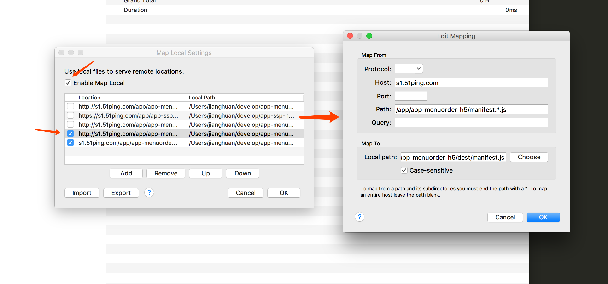

# Mac抓包工具Charles

过去在Windows系统下开发时，一直使用Fiddle进行抓包。现在换Mac后逐渐使用Charles抓包，首先从Charles官网[下载地址](https://www.charlesproxy.com/download/)下载安装。

这里简单介绍几种Charles的调试技巧:
## 一、用本地文件替换线上文件
### 1.1、替换beta上文件（51ping.com）
***
a、首先需要Chrome安装SwitchySharp插件并配置Charles代理，这样Chrome下的链接才会走Charles发送。
<div align="center">
    
    <p style="color: grey">图1 SwitchySharp插件配置</p>
    
    <p style="color: grey">图2 记得要切换到Charlse链接</p>
</div>

b、打开Charles，选择Tools —> No caching Seting，勾选Enable No Caching，确保不用缓存文件。

<div align="center">
    
    <p style="color: grey">图3 Charles不启用缓存设置</p>
</div>

另外，Chrome的Network设置里最好也勾选Disable Cache选项。如图4所示，这样可以在浏览器调试阶段也不启用缓存，防止修改了代码，但因为浏览器缓存未生效。

<div align="center">
    
    <p style="color: grey">图4 Chrome不启用缓存设置</p>
</div>

c、单个文件的替换。选择Tools —> Map Local Settings 将线上文件映射到本地文件, 点击选择要替换的文件(例如：mm-order-list.*.js)。注意protocal可以置空，这样就可以匹配https和http等多种协议。  
`注意：webpack打包的项目可能还需要根据实际情况映射manifest.*.js和common.*.js才可以完成替换。`
<div align="center">
    
    <p style="color: grey">图5 Charles替换单个文件配置</p>
</div>

d、 文件夹整体替换。按照步骤c，我们已经可以进行单文件替换了，但分别设置太麻烦了。所以我们直接进行文件夹整体替换。以配置app-menuorder-h5的项目为例，Host 和 Local Path 配置如图6所示:
<div align="center">
    
    <p style="color: grey">图6 Charles替换文件夹Map Local Setting/p>
</div>

配置完成Map Local Settings后，还需要配置Rewrite选项，通过正则表达式来替换对应目录下所有文件，如图7所示：

<div align="center">
    
    <p style="color: grey">图7 Charles替换文件夹 Rewrite Setting </p>
</div>

e、最后，刷新浏览器，如果Http的Respone Header里有X-Charles-Map-Local字段则代表本地文件替换成功。如图8所示：  
   `注意：如果是https链接，需要配置Charles支持对应域名的https协议才可以生效(没明白)`
<div align="center">
    
    <p style="color: grey">图8 文件替换成功效果图</p>
</div>

### 1.2、替换生产环境的文件（跨域dpfile.com）
用本地文件替换生产环境的文件同样需要设置 Map Local Settings 和 Rewrite Settings 两项。     

a、设置 Map Local Settings 进行文件目录映射，同图6，只需要把Host改成静态文件存储的域名即可，本例Host为：“www.dpfile.com”

b、设置 Rewrite Settings，这里需要分成两步：  
第一步，指定替换文件，注意线上的文件因为被压缩过，所以文件名中会有 “min” 字段。如图9所示：  
<div align="center">
    
    <p style="color: grey">图9 设置Map Local Settings 文件替换目录</p>
</div>

第二步，由于 "m.dianping.com" 引用映射后的 "www.dpfile.com" 域下的文件导致跨域问题（如图10所示）（为啥??）。
<div align="center">
    
    <p style="color: grey">图10 线上环境产生的跨域问题</p>
</div>
**所以需要对dpfile.com域下的Response Header添加字段**，允许跨域：Access-Control-Allow-Credentials: true 和 Access-Control-Allow-Origin: *，从而允许dpfile.com域下的文件被引用，如图11所示：

<div align="center">
    
    <p style="color: grey">图11 通过给Response Header添加字段，允许dpfile域下文件被引用</p>
</div>

按以上配置设置完毕后，即可用本地文件替换生产环境线上文件：）

## 二、用Charles抓手机的请求包
### 2.1 使用Charles抓http的请求包
***
使用Charles调试过程，打开Charles后，Help的Local IP Address 可以看到本机的IP地址（Mac上按住option点击WIFI图标）。在IPhone上的wifi手动设置HTTP代理，服务器地址为电脑的ip地址，端口号为8888. 然后在Charles的工具栏上打开Recording按钮，在用手机访问页面即可以抓包。

### 2.2 使用Charles抓https的请求包
***
#### 2.2.1 Iphone抓包
IPhone的抓 HTTPS 的包，网上配置很多，这里就不详细介绍了，附网络教程供大家参考：[ios安装charles](http://www.jianshu.com/p/235bc6c3ca77)
```
补充：按以上操作设置后，如果Iphone抓取https请求包时显示Unknown，如图12所示。则还需要按照此步骤设置：通用 —> 关于本机 —> 证书信任设置 —> CA勾选。
```
<div align="center">
    
    <p style="color: grey">图12 https请求Unknown</p>
</div>

#### 2.2.2 安卓手机抓包
```


安卓安装charles:Charles https抓包 — Android（这里需要拿到美团谢敏的授权）
```

## 三、其他
### 3.1. Charles筛选特定域下的请求
***
由于Charles会抓取手机所有的请求包，为了能快速找到我们需要的请求，可以对Charles的抓包请求进行筛选，具体方法是：Setting —> Recording Setting —> Include，可以设置只展示特定域的请求包。
<div align="center">
    
    <p style="color: grey">图3.1 通Charles筛选特定域下的请求</p>
</div>

## 参考文档：  
+ [Iphone安装charles](http://www.jianshu.com/p/235bc6c3ca77)
+ [Charles抓取https时一直显示unknown](https://segmentfault.com/q/1010000009188854)
+ [Charles https抓包 — Android](https://wiki.sankuai.com/pages/viewpage.action?pageId=664420154)

（Charles 电脑证书和手机证书的原理补充一下, 因为会不停弹出被监控，所以补充下如何删除证书）
