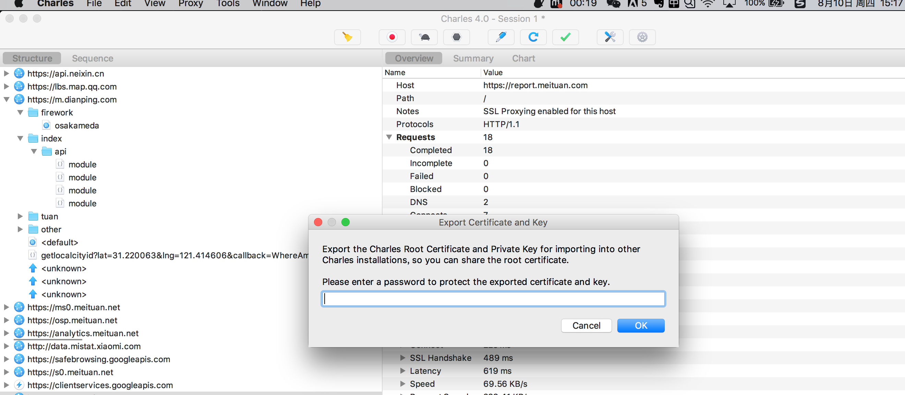

<h1>Mac抓包工具Charles</h1>

+ [用本地文件替换线上文件](#用本地文件替换线上文件)
    - [替换beta上文件](#替换beta上文件)
    - [替换生产环境的文件](#替换生产环境的文件)
+ [抓手机的请求包](#抓手机的请求包)
    - [使用Charles抓http的请求包](#使用Charles抓http的请求包)
    - [2.2 使用Charles抓https的请求包](#2.2 使用Charles抓https的请求包)
        - [2.2.1 iPhone抓https包](#2.2.1 iPhone抓https包)
        - [2.2.2 安卓手机抓https包](#2.2.2 安卓手机抓https包)
+ [其他](#其他)
    - [Charles筛选特定域下的请求](#Charles筛选特定域下的请求)
+ [参考文档](#参考文档)

过去在Windows系统下开发时，一直使用Fiddler进行抓包。现在换Mac后逐渐使用Charles抓包，首先从Charles官网[下载地址](https://www.charlesproxy.com/download/)下载安装。这里简单介绍几种Charles的调试技巧:

## 用本地文件替换线上文件
### 替换beta上文件
***
a、首先需要Chrome安装SwitchySharp插件并配置Charles代理，这样Chrome下的链接才会走Charles发送。

    
    
图1 SwitchySharp插件配置

    
    
图2 记得要切换到Charlse链接

b、打开Charles，选择Tools —> No caching Seting，勾选Enable No Caching，确保不用缓存文件。

    
    
图4 Charles不启用缓存设置

另外，Chrome的Network设置里最好也勾选Disable Cache选项。如图5所示，这样可以在浏览器调试阶段也不启用缓存，防止修改了代码，但因为浏览器缓存未生效。

    
    
图5 Chrome不启用缓存设置

c、单个文件的替换。选择Tools —> Map Local Settings 将线上文件映射到本地文件, 点击选择要替换的文件(例如：mm-order-list.*.js)。注意protocal可以置空，这样就可以匹配https和http等多种协议。  
`注意：webpack打包的项目可能还需要根据实际情况映射manifest.*.js和common.*.js才可以完成替换。`

    
    
图6 Charles替换单个文件配置

d、 文件夹整体替换。按照步骤c，我们已经可以进行单文件替换了，但分别设置太麻烦了。所以我们直接进行文件夹整体替换。以配置app-menuorder-h5的项目为例，Host 和 Local Path 配置如图7所示:

    
    
图7 Charles替换文件夹Map Local Setting

配置完成Map Local Settings后，还需要配置Rewrite选项，通过正则表达式来替换对应目录下所有文件，如图8所示：

    
    
图8 Charles替换文件夹 Rewrite Setting 

e、最后，刷新浏览器，如果Http的Respone Header里有X-Charles-Map-Local字段则代表本地文件替换成功。如图9所示：  
   `注意：如果是https链接，需要配置Charles支持对应域名的https协议才可以生效(没明白)`

    
    
图9 文件替换成功效果图

### 替换生产环境的文件
用本地文件替换生产环境的文件同样需要设置 Map Local Settings 和 Rewrite Settings 两项。     

a、设置 Map Local Settings 进行文件目录映射，同图6，只需要把Host改成静态文件存储的域名即可，本例Host为：“www.dpfile.com”

b、设置 Rewrite Settings，这里需要分成两步：  
第一步，指定替换文件，注意线上的文件因为被压缩过，所以文件名中会有 “min” 字段。如图10所示：  

    
    
图10 生产环境设置Map Local Settings 文件替换目录

第二步，由于 "m.dianping.com" 引用映射后的 "www.dpfile.com" 域下的文件导致跨域问题（如图11所示）（为啥??）。

    
    
图11 生产环境产生的跨域问题

**所以需要对dpfile.com域下的Response Header添加字段**：Access-Control-Allow-Credentials: true 和 Access-Control-Allow-Origin: *，从而允许dpfile.com域下的文件被其他域所引用，如图12所示：

    
    
图12 通过给Response Header添加字段，允许dpfile域下文件被引用

按以上配置设置完毕后，即可用本地文件替换生产环境线上文件：）

## 抓手机的请求包
### 使用Charles抓http的请求包
***
使用Charles调试过程，打开Charles后，Help的Local IP Address 可以看到本机的IP地址（Mac上按住option点击WIFI图标）。在IPhone上的wifi手动设置HTTP代理，服务器地址为电脑的ip地址，端口号为8888. 然后在Charles的工具栏上打开Recording按钮，在用手机访问页面即可以抓包。

### 2.2 使用Charles抓https的请求包
***
#### 2.2.1 iPhone抓https包
iPhone的抓 HTTPS 的包，网上配置很多，这里就不详细介绍了，附网络教程供大家参考：[ios安装charles](http://www.jianshu.com/p/235bc6c3ca77)  

**补充两点技巧：**

+ 技巧1：按以上操作设置后，如果Iphone抓取https请求包时显示Unknown，如图13所示。   
则说明Charles的证书在只在本机安装了，但还未选为信任，需要按照此步骤设置：**通用 —> 关于本机 —> 证书信任设置 —> CA勾选**。

    
    
图13 https请求Unknown

+ 技巧2：针对"SSL Proxying Settings"，如果不想每个域名都设置一次，可以直接把Host和Port都设为*，允许所有域名抓包。如图14所示：

    
    
图14 允许抓取所有SSL代理的数据包

#### 2.2.2 安卓手机抓https包
安卓的手机抓包与IOS相似，都需要按照以下4步来抓https的包：   

1. 电脑装证书  
2. 移动设备安装证书  
3. Charlse添加SSL Proxying  
4. 手机使用Mac代理访问目标域名  

**补充两种安装失败情况及解决办法**

+ 情况1：若遇到在模拟器/手机的浏览器中输入[http://charlesproxy.com/getssl](http://charlesproxy.com/getssl) 不是弹一个框，而是出现了图15情况，可能是因为手机没有将电脑的IP地址设为代理(端口号为8888)

    
    
图15 未将手机设置代理即访问getssl链接

+ 情况2：小米手机安装证书提示“没有可安装的证书”，解决方式：  

a、打开Charles的HELP -> SSL Proxying -> Export Charles Root Certification and Private Key，输入任意密码，导出pem文件。

    
    
图16 Charles导出Pem文件提取证书

b、导出后，用微信或者其他方式传到安卓手机里，在WLAN设置，安装证书里打开这个文件，输入导出时设置的密码就行了（比如通过微信方式的路径为 WLAN->高级设置->安装证书->Tencent文件夹->MicroMsg文件夹->Download文件夹）

    
    
图17 小米手机安装证书

***Charles原理解析***  
Charles抓包安装的证书，电脑和手机是配对的。不管是通过访问[http://charlesproxy.com/getssl](http://charlesproxy.com/getssl) (*因为Mac已经代理，所以访问这个地址实际上返回的本机的Charles证书，并没有访问charlesproxy.com这个网站*) 还是通过手动安装，实际上安装的都是对应本机的 SSL 证书。所以如果安装证书的手机和电脑不是配对关系的话，即使两者都有证书也是不能抓包的。

## 其他
### 筛选指定域下的请求
***
由于Charles会抓取手机所有的请求包，为了能快速找到我们需要的请求，可以对Charles的抓包请求进行筛选，具体方法是：Setting —> Recording Setting —> Include，可以设置只展示特定域的请求包。

    
    
图18 通Charles筛选特定域下的请求

## 参考文档
+ [Iphone安装charles](http://www.jianshu.com/p/235bc6c3ca77)
+ [Charles抓取https时一直显示unknown](https://segmentfault.com/q/1010000009188854)
+ [Charles https抓包 — Android —— 美团谢敏](https://wiki.sankuai.com/pages/viewpage.action?pageId=664420154)
