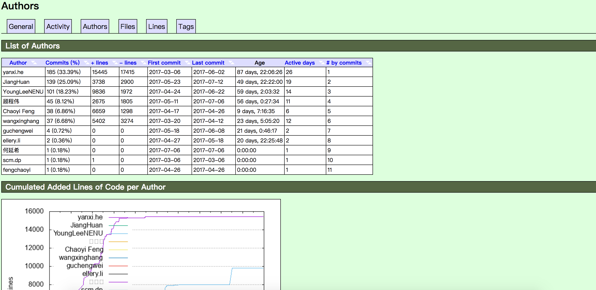

# 代码仓库统计工具GitStats

GitStats是代码仓库统计工具，[官网地址](http://gitstats.sourceforge.net/)

安装：
1. 在使用GitStats前需要先安装:Python和画图工具Gnuplot。
2. 安装GitStats，注意在osx环境下，官网的安装方法已不适用（brew install --HEAD homebrew/head-only/gitstats）。这是因为homebrew/head-only路径下的仓库已经废弃了，所以会无法安装。正确的安装如下：
<pre>
    git clone git://github.com/hoxu/gitstats.git
    cd gitstats
    ./gitstats 你的项目的位置 生成统计的文件夹位置  //使用方式
</pre>

效果图:

参考文档：[git代码统计](https://segmentfault.com/a/1190000008542123)
