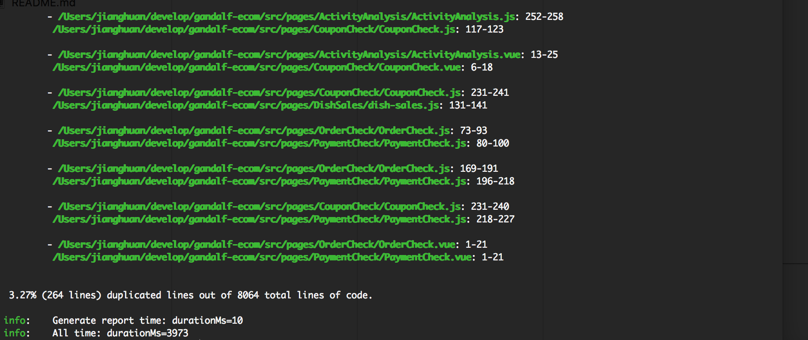
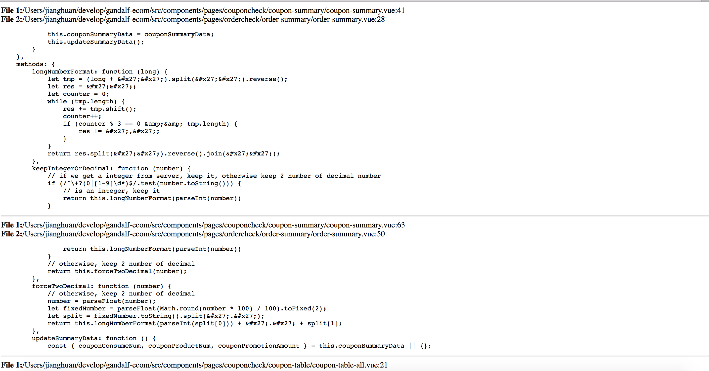

# 代码查重工具jscpd

jscpd是代码查重工具，可根据该工具定期优化项目代码，减少代码冗余[Git地址](https://github.com/kucherenko/jscpd)

效果图:
bash结果展示图:

XML文件详细结果图:

安装：
1. 全局安装 npm install jscpd -g
2. 在项目目录配置.cpd.yaml文件，参考如下

<pre>
#.cpd.yaml
languages:
- javascript
- typescript
- jsx
- vue
- css
files:
- 'src/**'
- 'less/**'
exclude:
- 'dist/**'
- 'dest/**'
- 'neurons/**'
- 'node_modules/**'
- 'test/**'
- 'data/**'
- 'css/**'
- 'entries/**'
reporter: xml
xsl-href: '/Users/dianping/dp/f2e-cpd/duplicateed-module.xsl'
limit: 100
min-tokens: 70
min-lines: 5
output: '/Users/dianping/dp/f2e-cpd/duplicateed-report.xml'
</pre>

注意：xsl-href的duplicateed-module.xsl作为xml引用的模板文件并不会由工具自动生成，需要用户手动添加进项目，如果不添加，duplicateed-report.xml文件在浏览器里无法正常渲染展示。这里给一个我们项目里的参考示例如下：

<pre>
<?xml version="1.0" encoding="UTF-8"?>
<xsl:stylesheet version="1.0" xmlns:xsl="http://www.w3.org/1999/XSL/Transform">
    <xsl:output
            encoding="UTF-8"
            method="html"
            omit-xml-declaration="yes"
            indent="no"
            doctype-public="-//W3C//DTD XHTML 1.0 Strict//EN"
            doctype-system="http://www.w3.org/TR/xhtml1/DTD/xhtml1-strict.dtd"/>

    <xsl:template match="pmd-cpd">
        <html xmlns="http://www.w3.org/1999/xhtml">
            <head>
                <meta http-equiv="content-type" content="text/html; charset=utf-8"/>
                <title>Copy-Paste Detection Report</title>
            </head>
            <body>
                <xsl:apply-templates select="duplication" />
            </body>
        </html>
    </xsl:template>

    <xsl:template match="duplication">
      

        <xsl:apply-templates select="file"/>
        
<pre><xsl:value-of select="codefragment"/></pre>

      

      

    </xsl:template>

    <xsl:template match="file">
      
<strong>File <xsl:value-of select="position()"/>:</strong> <xsl:value-of select="@path"/>:<xsl:value-of select="@line"/>

    </xsl:template>
</xsl:stylesheet>
</pre>

3. 查看结果：bash中直接输入'jscpd'即会自动生成总结果，同时会根据.cpd.yaml配置中的output生成xml文件，可以用safari直接打开查看详细结果。同时，由于chrome采用了自有的本地文件安全协议，禁止xml文件套用本地xsl模板，因此duplicateed-report.xml文件无法在chrome中打开。

参考文档：[终端代码重复率检测实践](https://juejin.im/post/5948c8ebac502e006bb4685b)
