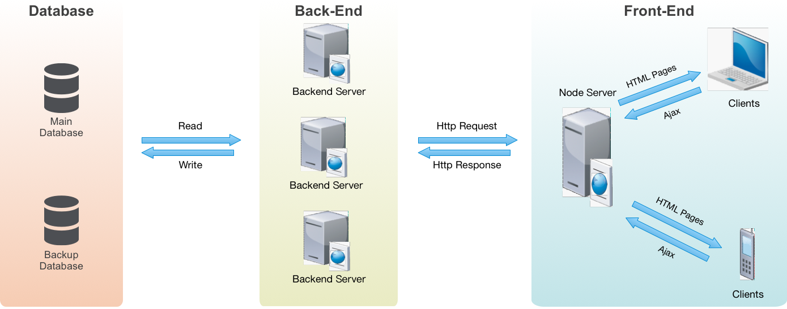

# 点餐终端前后端分离总结

> 现代前端开发中，前端和后端 的界限已经越来越模糊了，随着前端的不断发展，前端开发的边界在逐渐的被推向后端。在2009年 Node.js 横空出世，随着其社区的凶猛发展，前端圈子中用javascript来作服务器相关的开发一度成为一种时尚。

### 为什么前后端分离
结合美团点评的点餐业务，实现前后端分离有以下几点好处:

+ 前端模板渲染：分离后的页面由前端服务器渲染生成，前端可以用ejs等模板直接渲染生成，甚至静态的页面可以直接用html文件来替代。而再此之前，前端工程师开发完后页面后，还会将html文件交给后端转换为java的ftl模板，这样不仅增加了总体工作量，之后的沟通和联调成本也十分显著。同时对没用过ftl模板语言的工程师来说，其学习成本也还得考虑进去。

+ 解决跨域问题：因为渐进迭代和历史遗留问题，目前点餐业务的前端页面是部署在美团静态服务器上的，而页面上Ajax请求的目标接口则是对应后端的java服务器，因此会产生跨域问题。在启用Node Server作为代理转发请求后跨域问题迎刃而解。

+ 前端路由控制：通过前后端分离，路由控制完全交给前端处理，后端只用纯粹地提供各种API接口，更专心于业务逻辑层的开发。

同时，前后端分离有利也有弊:

+ 前端工作量增加：由于用户访问的第一道Server开始变为前端服务器，前端也需要参与服务端的开发，工作量会加大不少。

+ 对团队整体技术水平的要求更高。

+ 不利于SEO优化：如果网站前端只使用SPA(Single Page Application 单页应用)搭建，node服务器只单纯做接口代理，则会不利于搜索引擎抓取网站数据。所以可以采用首屏SSR(Server Side Render 服务端渲染)的方式，Node服务器直接作为前端模板引擎渲染出首屏页面，来进行SEO优化。

### 如何前后端分离
基于以上几点，美团点评点餐业务通过Node.js来搭建前端服务器，实现了基于KOA的前后端分离，系统结构图如下：

美团点评点餐业务前后端分离结构图

在这种模式下，前后端的权责区分更加清晰：

1. 路由完全交由前端控制，前端可以自主进行独立URL Design。

2. 用户终端直接访问前端服务器，Node服务器用来进行模板渲染和请求转发工作。后端从”套模板“的工作中解放，专注于对业务逻辑的处理和接口的提供。

3. Node服务端在拿到客户端请求后，转发给后端的java服务器，通过Node层和Java层实现更高效的通信，同时解决了跨域问题。  

### 什么样的业务不适合前后端分离
商业产品，业务为主，不要为了技术而技术。业务有适合前后端分离的就一定也有不适合的，下面列出部分我认为不太适合的场景，以供参考：

1. 较简单的内部管理系统，这样的系统就不需要前后端分离，否则只会白白增加很多工作量。
2. 对于无需频繁更改的业务，也可以考虑使用传统的开发方式。
3. 对小公司或者创业公司来说，初期可以不用分的这么细，毕竟使用越复杂的方式，对团队成员的技术水平也会要求更高。

### 参考文档
- [Web 研发模式的演变](https://github.com/lifesinger/blog/issues/184)
- [前后端分离必要性](http://www.itwendao.com/article/detail/219126.html)
- [前端后端分离，怎么解决SEO优化的问题呢？](https://www.zhihu.com/question/52235652)
- [从单页应用(SPA)到服务器渲染(SSR)](http://www.jianshu.com/p/1e63f434051d)
- [Node.js 框架对比之 Express VS Koa](http://www.cnblogs.com/sybboy/p/6418526.html)

