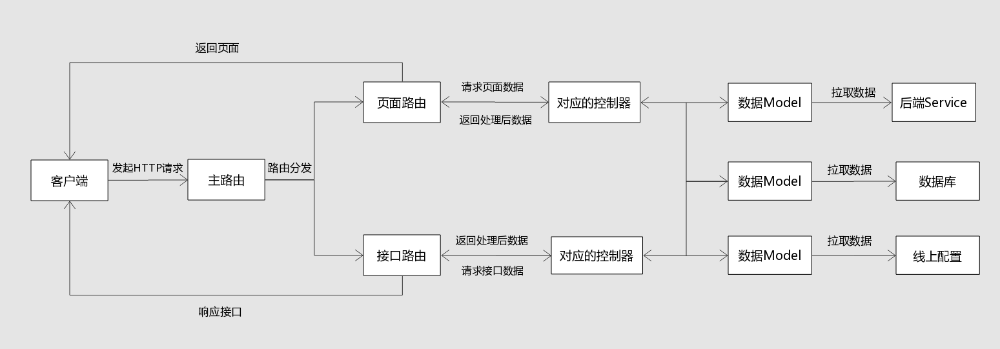

# 点餐终端前后端分离实践

> 随着前端技术的发展，现如今前端开发的边界正逐渐被推向后端，两者的界限在重合与分离中不断交替。回首过往，Node.js在2009年的横空出世可以看作前端开发的里程碑事件，从此JavaScript不在局限于浏览器的狭窄空间，开始在服务器的广阔天空上展翅翱翔。

点餐终端团队在2017年Q2启动了监控平台的建设工程，按照新技术先小范围试点再逐步推广到整条业务线的模式，我们开始在监控平台搭设自己的前端服务系统。

### 一、为什么前后端分离
---
结合美团点评点餐的过往业务来说，实现前后端分离有以下几点好处:

+ 前端模板渲染：在以后端为主MVC时代，前端通常会在本地写demo，再将html文件交给后端套ftl模板，这样不但增加了总体工作量，之后的沟通和联调成本也十分显著。而分离后，页面改由前端服务器渲染生成，前端可以用ejs等模板直接开发，省去了不少沟通成本。

+ 路由控制：通过前后端分离，路由控制权完全交由前端，后端回归到纯粹提供接口服务，更专心于各种业务逻辑的开发。

+ 跨域问题：因为渐进迭代和历史问题，目前点餐业务部分前端页面是部署在美团静态服务器上的，而页面上Ajax请求的目标接口则是对应后端的Java服务器，由此产生了跨域问题。在启用Node服务器作为代理转发请求后，跨域问题也自然解决。

同时，前后端分离有利也有弊:

+ 前端工作量增加：分离之后，前端也需要参与到服务端的开发，自然工作量会加大不少。

+ 对团队整体技术水平的要求更高。

### 二、如何前后端分离
---
基于以上几点，点餐监控平台通过Node.js来搭建前端服务器，实现了基于KOA的前后端分离架构，系统结构图1所示：  

图1 美团点评点餐业务前后端分离结构图

在这种模式下，前后端的权责区分更加清晰：

1. 路由完全交由前端控制，前端可以自主进行独立URL Design。

2. 用户终端直接访问Node服务器，Node服务器进行模板渲染和请求转发工作。后端从”套模板“的工作中解放，专注于业务逻辑处理和接口提供。

3. Node服务器在拿到客户端请求后，转发给后端Java服务器，前后端服务器在内网环境进行更高效通信(毫秒级)的同时也解决了跨域问题。  

### 三、从无到有搭建一个Node服务器
---
常见的Node.js服务框架包括Express, Koa, Feathers等等。目前美团点评使用的是基于Koa封装的自有开发框架，集成了公司配套的监控，服务调用，账号解析等中间件，方便各条业务线快速搭建服务。由于涉及公司内部代码，无法开源。因此，下面部分只是我自己写的一个小Demo，方便大家参考部署自己的Node应用。需要一提的是，Koa本身是不带任何中间件的轻量级框架，这里只是提供一种工程化的思路，读者也可以按自己的喜好进行配置。
#### 0、项目资源地址
---

GitHub地址：[https://github.com/Dragon-Rider/node-server](https://github.com/Dragon-Rider/node-server)

线上访问地址：[www.neitui100.com](www.neitui100.com:3000)

#### 1、项目的工程目录结构
---
Koa本身自带快速生成项目的方法，在全局安装Koa后，可以通过 "koa + project name" 的方式快速生成，但是目录结构比较简单，不适合我们工程化的解决方案。因此我们重构了新的目录结构，如下所示：  
<pre>
    |
    |——src                #业务逻辑目录
    |   |
    |   |——common         #公共文件目录
    |   |——controllers    #控制器目录
    |   |——models         #数据模型目录
    |   |——views          #页面模板目录
    |   |——routes         #路由目录
    |   |    |
    |   |    |——index.js         #主路由
    |   |    |——apiRouter.js     #接口路由
    |   |    |——pageRouter.js    #页面路由
    |   |
    |   |——public                #静态资源目录
    |        |——img
    |        |——css
    |        |——js
    |
    |——logs            #日志文件输出目录
    |——config          #项目配置文件目录
    |——node_modules    #node包依赖目录
    |——app.js          #项目入口文件
    |——package.json    #工程管理文件，涉及依赖配置、环境配置、启动命令等。
</pre>
在项目里我们采用了MVC风格的结构。当客户端发起请求的时候，Node服务器会先由主路由文件作为请求入口，将请求分发给各个子路由。子路由在监听到对应的HTTP请求后，会向对应的控制器请求数据。控制器访问不同的数据Model，并对各个Model返回的数据进行统一处理与封装。之后将处理后的数据返回给路由，最终响应客户端的请求。一个标准的请求响应过程如图2所示：

图2 Node服务器响应请求流程图

### 2、服务器日志打印
---
作为生产环境的项目，出了问题需要能迅速排查原因，因此增加服务稳定性监控和出错记录是必不可少的环节。目前，美团点评内部服务系统配套了专门的监控组件进行错误记录与上报，而读者也可以使用 PM2 或者 log4js-node 进行错误日志输出记录，本文不在赘述。

这里提一下Demo里使用的一个Koa配套日志中间件Koa-logger，该中间件可以在开发的过程中实时监听请求，并在控制台实时打印日志。启用也十分方便，只需在项目入口文件app.js里配置"app.use(logger());"命令即可。其打印日志效果图如下所示：

    
    
图3 koa-logger打印日志效果图

### 3、静态文件与模板渲染
---
在这个样本项目中，我采用了ejs模板引擎进行视图模板的搭建。通过koa-static组件设置静态资源目录，同时使用koa-mount组件来将资源路径映射到static路径下。

    const app = require('koa')();
    const staticServe = require('koa-static');
    const path = require('path');
    const staticDirectory = staticServe(__dirname + '/src/public');

    app.use(mount('/static', staticDirectory));

视图文件统一放置于views目录下，使用koa-ejs进行模板渲染，该组件支持layout布局和 ejs 的include模板嵌套语法。同时由于静态资源路径已经配置完毕，所以在ejs模板里直接引入即可。

    <!DOCTYPE html>
    <html lang="en">
    <head>
        <meta charset="UTF-8">
        <title><%= params.title %></title>
        <link rel="stylesheet" href="/static/css/page.css">
    </head>
    <body>
        <h1><%= params.content %></h1>
        <button id="btn1">click me!</button>
        <% include footer.ejs %>
    </body>

    
    </html>

在大公司开发的过程中，往往还会再将View层进行抽离。目前比较流行的做法是用 React 或者 Vue 搭建一个纯前端的单页应用，但这同时也会带来一些SEO问题，需要在针对性地引入服务端渲染方案进行处理。

### 4、控制器与数据处理
---

### 5、数据获取与数据库操作
---

### 第一个服务端脚本demo
---
1. 连接mysql，在公司的生产环境不需要，通过与Java层交互，权责更清晰，效率更高  
5. 用淘宝ip举例子拿Java层数据

### 什么样的业务不适合前后端分离
---
商业产品，业务为主，永远应该由业务来决定技术。同时，在软件工程领域也不存在银弹，没有最好的技术，只有最适合当下业务发展的技术方案。因此有适合前后端分离的业务，也就会有不适合的，下面列出部分我认为不太适合的场景，以供参考：

1. 较简单的内部管理系统，这样的系统就不需要前后端分离，否则只会白白增加很多工作量。

2. 对于无需频繁更改的业务，也可以考虑使用传统的开发方式。

3. 对小公司或者创业公司来说，初期可以不用分的这么细，毕竟使用越复杂的方式，对团队成员的技术水平也会要求更高。

### 总结

### 参考文档
- [Web 研发模式的演变](https://github.com/lifesinger/blog/issues/184)（好文章）
- [koa技术分享](http://cnodejs.org/topic/56936889c2289f51658f0926)

- [基于 KOA2 + Typescript 的 web 开发框架介绍](http://www.nodepeixun.com/a/nodekuangjia/20170314/171.html)（考虑是否加入参考文档）
- [Node直出理论与实践总结](https://github.com/joeyguo/blog/issues/8)（好文章）（本文为未用到）
- [前后端分离必要性](http://www.itwendao.com/article/detail/219126.html)
- [前端后端分离，怎么解决SEO优化的问题呢？](https://www.zhihu.com/question/52235652)（本文为未用到）
- [从单页应用(SPA)到服务器渲染(SSR)](http://www.jianshu.com/p/1e63f434051d)（本文为未用到）
- [Node.js 框架对比之 Express VS Koa](http://www.cnblogs.com/sybboy/p/6418526.html)（本文为未用到）

### Memos
4. 参考文档梳理，去除未引用的
6. node-server-demo 加readme使用方法
10. 引入babel吗，import之类的，引入webpack打包？？

