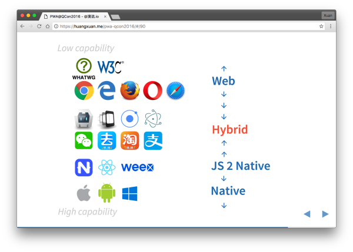
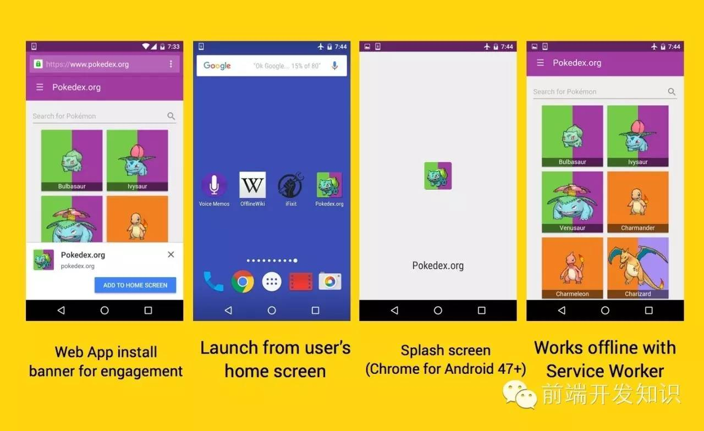
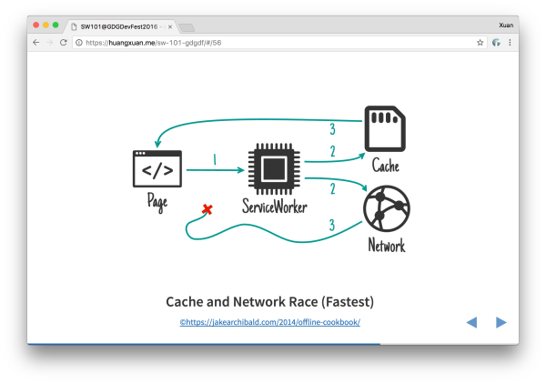
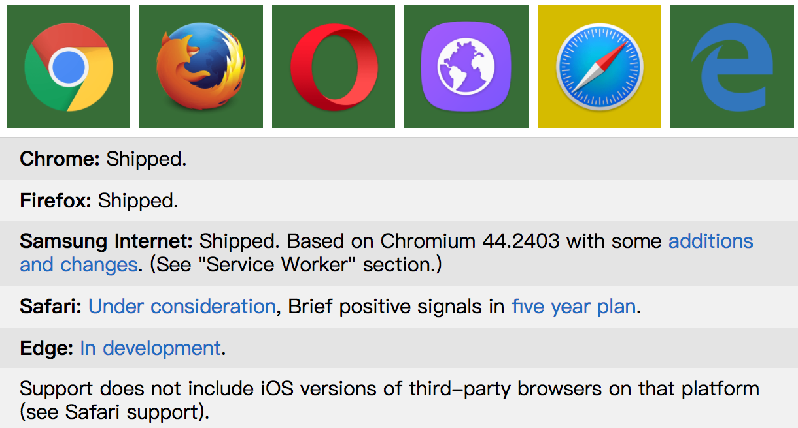

# PWA简介
### 1. PWA介绍
PWA全称为Progressive Web App，是一个利用现代浏览器的能力来达到类似APP的用户体验的技术，由Google开发，让浏览器打开的网址像APP一样运行在手机上。让Web App和Native App之间的差距更小。

在不丢失 web 的开放灵魂，在不需要依靠 Hybrid 把应用放在 App Store 的前提下，让 web 应用能够渐进式地跳脱出浏览器的标签，变成用户眼中的 App。这是 Alex Russell 在 2015 年提出 PWA 概念的原委。

    

目前常见的技术选型

#### 特性概览

**Installability （可安装性）**：可被添加自主屏与全屏运行。IOS从1.1.3就支持把网页添加到桌面上，但不支持全屏。

**App Shell**：第一次渲染个壳、等异步数据来了再填充。

**Offline （离线能力）**：离线和弱网环境也能秒开，依赖Service Worker作为代理。

**Re-engageable**： 再次触达用户，目前主要就是推送通知的能力。推送通知依赖Service Worker与HTTP Push，Google默认支持GCM(Google Cloud Messaging)。

  

PWA的特性

其中Service Worker起到了关键的作用，那么什么是Service Worker？

### 2. Service Worker
简单来说，Service Worker 是一个可编程的 Web Worker，它就像一个位于浏览器与网络之间的客户端代理，可以拦截、处理、响应流经的 HTTP 请求；配合随之引入 Cache Storage API，你可以自由管理 HTTP 请求。而文件粒度的缓存，使得 Service Worker 可以从缓存中向 web 应用提供资源，即使是在离线的环境下。

Service Worker工作模式

浏览器厂商对Service Worker的支持情况：

+ Chrome(49+), Firefox(51+), Opera已支持；  
+ Miscrosoft Edge 表示正在开发相关功能；  
+ Safari表示正在考虑将其纳入“五年计划”。  

Service Worker 第一次发布于 2014 年的 Google IO 上，目前已处于 W3C 工作草案的状态。各家厂商的最新支持情况可[查看](https://jakearchibald.github.io/isserviceworkerready/) 

Service Worker当前的支持情况

### 3. Service Worker的应用

*Service Worker 就像一个运行在客户端的代理*

比如说，我们可以给网页 index.html 注册这么一个 Service Worker，它将劫持由 index.html 发起的一切 HTTP 请求:

    if ('serviceWorker' in navigator) {
            navigator.serviceWorker.register('./sw.js').then(function(registration) {
            console.log('ServiceWorker registration successful', registration);
        }).catch(function(err) {
            registration failed :(
            console.log('ServiceWorker registration failed: ', err);
        });
    }

*当用户离线，网络无法访问时，我们就可以从缓存中启动我们的 web 应用:*

    self.addEventListener('install', event => {
        event.waitUntil(
            caches.open(PRECACHE)
            .then(cache => {
                cache.addAll(PRECACHE_URLS);
                console.log('Opened cache');
            })
            .then(self.skipWaiting())
        );
    });

*Service Worker注册时将文件注入缓存:*

    self.addEventListener('fetch', event => {
        console.log(event.request);
        event.respondWith(
            caches.match(event.request).then(cachedResponse => {
                if (cachedResponse) {
                    console.log('cache hit and respongse success!');
                    return cachedResponse;
                }
                console.log('cache did not hit.');
                return caches.open(RUNTIME).then(cache => {
                    return fetch(event.request).then(response => {
                        // Put a copy of the response in the runtime cache.
                        return cache.put(event.request, response.clone()).then(() => {
                            return response;
                        });
                    });
                });
            })
        );
    });

chrome查看当前启动的Service Worker：[chrome://inspect/#service-workers](chrome://inspect/#service-workers)

Service Worker的生命周期

Service worker拥有一个完全独立于Web页面的生命周期。

要让一个Service Worker在你的网站上生效，你需要先在你的网页中注册它。注册一个Service Worker之后，浏览器会在后台默默启动一个Service Worker的安装过程。

在安装过程中，浏览器会加载并缓存一些静态资源。如果所有的文件被缓存成功，Service Worker就安装成功了。如果有任何文件加载或缓存失败，那么安装过程就会失败，Service Worker就不能被激活（也即没能安装成功）。如果发生这样的问题，别担心，它会在下次再尝试安装。

当安装完成后，Service Worker的下一步是激活，在这一阶段，你还可以升级一个Service Worker的版本。

在激活之后，Service Worker将接管所有在自己管辖域范围内的页面，但是如果一个页面是刚刚注册了Service Worker，那么它这一次不会被接管，到下一次加载页面的时候，Service Worker才会生效。

当Service Worker接管了页面之后，它可能有两种状态：要么被终止以节省内存，要么会处理Fetch和Message事件，这两个事件分别产生于一个网络请求出现或者页面上发送了一个消息。

### 4. 不足之处
Service Worker的消息推送功能在国内无法使用。由于网络长城的存在国内被墙，不翻墙无法向国内用户推送信息。

MDN的解释：  
*The service worker also has to subscribe to the push messaging service. Each session is given its own unique endpoint when it subscribes to the push messaging service. This endpoint is obtained from the (PushSubscription.endpoint) property on the subscription object. This endpoint can be sent to your server and used to send a message to that session's active service worker. Each browser has its own push messaging server to handle sending the push message.*

每个浏览器使用它们自己的消息推送服务器用来处理消息推送。

### 5. PWA的意义
PWA 作为一个涵盖性术语，与过往的这些或多或少通过私有平台 API 增强 web 应用的尝试最大的不同，在于构成 PWA 的每一项基本技术，都已经或正在被 IETF、ECMA、W3C 或 WHATWG 标准化，不出意外的话，它们都将被纳入开放 web 标准，并在不远的将来得到所有浏览器与全平台的支持。我们终于可以逃出 App Store 封闭的秘密花园，重新回到属于 web 的那片开放自由的大地。

援引网络留言：“PWA 很虚是因为所有 PWA 用到的技术都已经或正在被谷歌推举为 Web API，所以 PWA 和非 PWA 并没有一个严格的界定，这点和微信小程序那样的私有平台是完全不同的。可能今天我们叫做 PWA 的东西明天就已经只是普通的 Web App 了，这也是 Web 的真正价值所在。”

### 6. 国内例子
“饿了么”的m站：[https://h5.ele.me/msite/](https://h5.ele.me/msite/)，可断网体验。

#### 参考文档:
+ [下一代 Web 应用模型 — Progressive Web App](https://zhuanlan.zhihu.com/p/25167289)
+ [Web新技术：PWA-Progressive Web App](http://www.wtoutiao.com/p/179Lecv.html)
+ [我们真的需要网页版App吗？Google PWA的困局](http://www.leiphone.com/news/201606/UEiart497WUzS62u.html)
+ [从webWorker到serviceWorker](https://my.oschina.net/zhangstephen/blog/541298)
+ [使用Service Worker](https://developer.mozilla.org/zh-CN/docs/Web/API/Service_Worker_API/Using_Service_Workers#注册你的_worker)
+ [Service Worker初体验](http://web.jobbole.com/84792/)
+ [Service Worker入门](https://www.w3ctech.com/topic/866)
+ [PWA在饿了么的实践经验](http://www.qingpingshan.com/bc/xg/234191.html)
+ [[Service Worker]消息推送功能“全军覆没”](https://www.zhengqingxin.com/post/push-knock-the-door.html)

